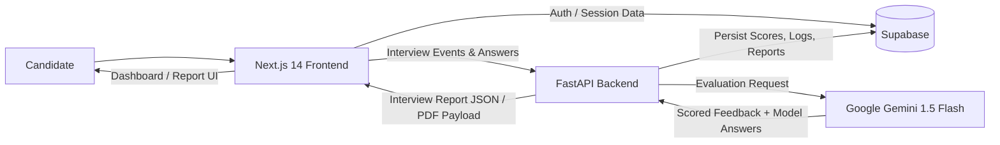

# AI-Powered Technical Mock Interview Platform


An enterprise-ready, **$0-cost**, production-ready AI Mock Interview platform designed to help candidates prepare across every major technical track, including MERN, ML/AI, DevOps, Data Engineering, QA, Cybersecurity, and Cloud.  
It combines a modern Next.js frontend, FastAPI backend, Supabase data layer, and token-optimized Gemini 1.5 Flash evaluation pipeline to deliver realistic voice interview simulation and deeply actionable feedback.  
The system is built to be extensible for custom roles, frameworks, and domain-specific interview rubrics.

---

## Key Features

- **Real-time speech-to-text + speech synthesis** with a zero-audio-API-cost approach.
- **Domain-specific interview evaluation engine** with support for custom roles and framework-specific prompts.
- **Deep feedback reports**: mistake analysis, missing keyword highlights, and ideal model answers for each interview question.
- **One-click PDF performance report export** for easy sharing and revision.
- **Token-optimized single-pass Gemini 1.5 Flash architecture** for low latency and lower inference cost.

---

## High-Level Architecture



---

## Codebase Scan Summary (Current Branch)

The repository was scanned for `./frontend` and `./backend` source code, API route declarations, environment files, and schema/migration files.

- `frontend/` directory: **not found**
- `backend/` directory: **not found**
- `.env*` files: **not found**
- API route definitions: **none detected in this branch**
- Database schema/migration files: **none detected in this branch**

### Extracted API Routes

No backend route files are present in the current repository branch, so no concrete API endpoints could be extracted.

### Extracted Database Schema

No SQL/ORM schema or migration files are present in the current repository branch, so no concrete table/schema definitions could be extracted.

---

## Local Setup

> Since application source folders are not present in this branch yet, use the following as the expected setup blueprint once `frontend/` and `backend/` are available.

### 1) Clone Repository

```bash
git clone https://github.com/tarunkumar-dev1/mock_interview_platform.git
cd mock_interview_platform
```

### 2) Frontend Setup (`./frontend`)

```bash
cd frontend
npm install
cp .env.example .env.local  # or create .env.local manually
npm run dev
```

Suggested frontend environment variables:

```env
NEXT_PUBLIC_SUPABASE_URL=
NEXT_PUBLIC_SUPABASE_ANON_KEY=
NEXT_PUBLIC_API_URL=
```

### 3) Backend Setup (`./backend`)

```bash
cd backend
python -m venv .venv
source .venv/bin/activate
pip install -r requirements.txt
cp .env.example .env  # or create .env manually
uvicorn app.main:app --reload --host 0.0.0.0 --port 8000
```

Suggested backend environment variables:

```env
GEMINI_API_KEY=
SUPABASE_URL=
SUPABASE_SERVICE_ROLE_KEY=
FRONTEND_URL=
```

---

## Project Structure (Current Branch)

```text
mock_interview_platform/
└── README.md
```

---

## Contributing

Contributions are welcome.

1. Fork the repository.
2. Create a feature branch: `git checkout -b feat/your-feature-name`
3. Commit your changes: `git commit -m "feat: add your feature"`
4. Push your branch and open a Pull Request.

Please keep PRs focused, tested, and clearly described.

---

## License

This project is licensed under the **MIT License**.

```text
MIT License

Copyright (c) 2026

Permission is hereby granted, free of charge, to any person obtaining a copy
of this software and associated documentation files (the "Software"), to deal
in the Software without restriction, including without limitation the rights
to use, copy, modify, merge, publish, distribute, sublicense, and/or sell
copies of the Software, and to permit persons to whom the Software is
furnished to do so, subject to the following conditions:

The above copyright notice and this permission notice shall be included in all
copies or substantial portions of the Software.

THE SOFTWARE IS PROVIDED "AS IS", WITHOUT WARRANTY OF ANY KIND, EXPRESS OR
IMPLIED, INCLUDING BUT NOT LIMITED TO THE WARRANTIES OF MERCHANTABILITY,
FITNESS FOR A PARTICULAR PURPOSE AND NONINFRINGEMENT. IN NO EVENT SHALL THE
AUTHORS OR COPYRIGHT HOLDERS BE LIABLE FOR ANY CLAIM, DAMAGES OR OTHER
LIABILITY, WHETHER IN AN ACTION OF CONTRACT, TORT OR OTHERWISE, ARISING FROM,
OUT OF OR IN CONNECTION WITH THE SOFTWARE OR THE USE OR OTHER DEALINGS IN THE
SOFTWARE.
```
